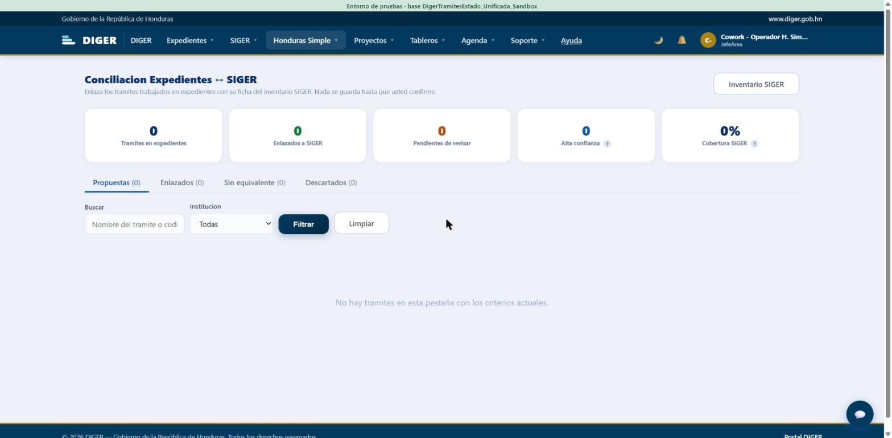
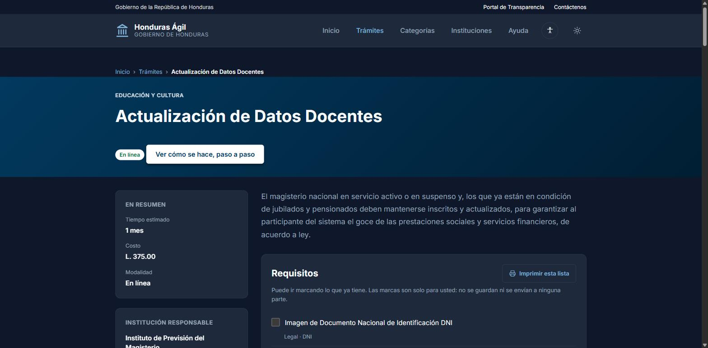
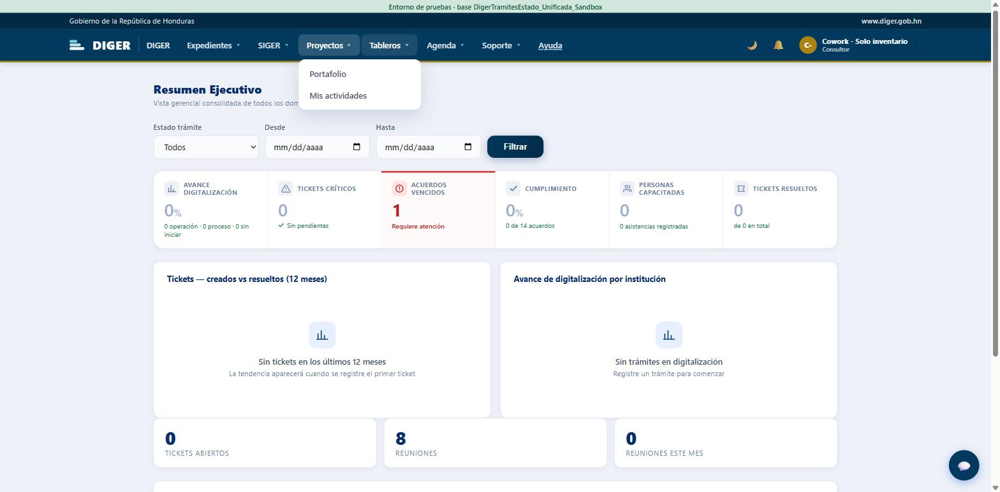

# Hallazgos — pruebas de la separación SIGER / Honduras Simple

**Fecha de la corrida:** 4 de septiembre de 2026
**Recorrido seguido:** `docs/flujo-de-pruebas-separacion-honduras-simple.html`, los 20 pasos, en orden (con una salvedad de orden en el tramo E, explicada en el hallazgo H-05).
**Resultado global:** 19 pasos OK, 1 FALLA (paso 8). Además, 6 observaciones fuera del guion.

Este documento es para quien vaya a corregir. **No trae diagnóstico de causa**: quien probó tenía instrucción explícita de no investigar el porqué ni tocar código, `appsettings.json` ni base de datos. Todo lo de abajo es lo observado, con los datos para reproducirlo.

---

## Entorno

| | |
|---|---|
| Portal interno | `https://localhost:49175` |
| Portal ciudadano | `https://localhost:7180` |
| API | `https://localhost:7199/swagger` (HTTPS) · `http://localhost:5199/swagger/index.html` (HTTP) |
| Base | `DigerTramitesEstado_Unificada_Sandbox` (cinta verde confirmada antes de empezar) |
| Navegador | Chrome, ventanas normales, sesiones secuenciales (un usuario a la vez) |
| Levantado con | `scripts\pruebas\Refrescar-Sandbox.ps1` + `scripts\Iniciar-Todo.ps1` |

**Usuarios** (contraseña de los tres: `Pruebas#2026`, solo existen en el sandbox):

| Correo | Rol | Papel |
|---|---|---|
| `inventario.cowork@diger.gob.hn` | Consultor | El de fuera. Solo debería alcanzar el inventario. |
| `operador.cowork@diger.gob.hn` | Jefe de Área | Hace el trabajo. **No es administrador.** |
| `admin.cowork@diger.gob.hn` | Administrador | Solo para abrir y cerrar permisos. |

> El operador tiene concedidos a mano en el sandbox **Conciliación** y **Publicado** (Ver y Editar). No es cosa de este cambio: bajo SIGER esas dos pantallas no estaban concedidas a ningún rol y solo las alcanzaban los administradores, que se saltan la matriz. Se concedieron para que el paso 7 tenga sentido.

---

## Resultado de los 20 pasos

```
Paso 1    OK      Paso 11   OK
Paso 2    OK      Paso 12   OK
Paso 3    OK      Paso 13   OK
Paso 4    OK      Paso 14   OK
Paso 5    OK      Paso 15   OK
Paso 6    OK      Paso 16   OK
Paso 7    OK      Paso 17   OK
Paso 8    FALLA   Paso 18   OK
Paso 9    OK      Paso 19   OK
Paso 10   OK      Paso 20   OK
```

Lo que la separación sí demostró, y que conviene no romper al arreglar lo de abajo:

- Las seis rutas de escritura (`/HondurasSimple/Editor`, `Archivo`, `CapturaLote`, `Llenado`, `Conciliacion`, `Publicacion`) rebotan al Consultor a `/Cuenta/Denegado`, escritas a mano, las seis.
- Las siete pantallas abren para el operador **sin ser administrador**, Conciliación incluida.
- Las siete rutas viejas `/Siger/*` redirigen a `/HondurasSimple/*` conservando la query (`?tab=candidatas` llega entera).
- Quitarle el área Honduras Simple al rol Consultor le cierra la puerta al instante y **deja SIGER funcionando**; volver a marcarla la reabre.
- Publicar y despublicar llega al portal ciudadano en los tiempos documentados (~15 s el alta, ~5 min la baja).

---

## H-01 · FALLA · Conciliación abre vacía

**Prioridad:** alta — es el único paso del recorrido que falla.

| | |
|---|---|
| Paso del recorrido | 8 |
| Usuario | `operador.cowork@diger.gob.hn` (Jefe de Área, no administrador) |
| Dirección | `https://localhost:49175/HondurasSimple/Conciliacion` |

**Esperaba:** que la lista trajera registros y que los filtros respondieran; que nada quedara en blanco ni tirara a la pantalla de error.

**Pasó:** la pantalla abre —no es acceso denegado ni error, y por eso el paso 7 sí se da por bueno— pero llega sin nada dentro:

- Los cinco contadores en cero: *Trámites en expedientes 0*, *Enlazados a SIGER 0*, *Pendientes de revisar 0*, *Alta confianza 0*, *Cobertura SIGER 0 %*.
- Las cuatro pestañas en cero: *Propuestas (0)*, *Enlazados (0)*, *Sin equivalente (0)*, *Descartados (0)*.
- En el cuerpo: «No hay tramites en esta pestaña con los criterios actuales.»
- No se pudieron probar los filtros ni entrar en un caso, porque no hay ninguno.

**El dato que más llama la atención:** el contador **«Inventario SIGER» marca 0**, cuando `/Siger` reporta **1057 trámites registrados** en la misma sesión y la misma base. Los otros contadores en cero podrían explicarse por un sandbox sin expedientes; ese no.

**Cómo reproducir**

1. Entrar como `operador.cowork@diger.gob.hn`.
2. Ir a `https://localhost:49175/HondurasSimple/Conciliacion` (o Honduras Simple → Conciliación).
3. Comparar el contador *Inventario SIGER* con el de `https://localhost:49175/Siger`.

**Criterio de aceptación:** la lista trae registros, los filtros responden, se puede entrar en un caso, y el contador *Inventario SIGER* concuerda con el total del inventario.



---

## H-02 · Cerrar sesión pide permisos

**Prioridad:** alta — afecta a cualquiera que no sea administrador, y es de las cosas que se notan el primer día.

| | |
|---|---|
| Usuario | `inventario.cowork@diger.gob.hn` (Consultor) |
| Dirección resultante | `https://localhost:49175/Cuenta/Denegado?ReturnUrl=%2FCuenta%2FLogout` |

**Pasó:** al pulsar **Cerrar sesión** en el menú del usuario, el portal manda a *Acceso denegado* y **la sesión queda abierta** — al volver a `/Tableros` el usuario sigue dentro. Reproducido dos veces por dos personas distintas: una vio la pantalla de acceso denegado y la otra un mensaje de que necesitaba permisos.

**Cómo reproducir**

1. Entrar como `inventario.cowork@diger.gob.hn`.
2. Abrir el menú del usuario (arriba a la derecha) → *Cerrar sesión*.
3. Navegar a `https://localhost:49175/Tableros`: la sesión sigue viva.

**Criterio de aceptación:** cerrar sesión funciona para cualquier rol, sin pasar por la tabla de permisos.

---

## H-03 · «Aprobar las N que coinciden con el filtro» no hace nada

**Prioridad:** media — hay camino alterno, pero es justo el botón pensado para el volumen.

| | |
|---|---|
| Usuario | `operador.cowork@diger.gob.hn` |
| Dirección | `https://localhost:49175/HondurasSimple/Llenado?tab=pendientes&buscar=400-009` |

**Pasó:** con el filtro aplicado (2 propuestas coincidiendo), el botón **«Aprobar las 2 que coinciden con el filtro»** no produce ningún efecto: no aparece aviso, no cambian los contadores, las propuestas siguen en *Por revisar*. Tres intentos, con la fila y el botón visibles en pantalla. En uno de ellos la página quedó sin responder unos segundos y hubo que recargar; al recargar, nada se había guardado.

**Lo que sí funciona:** marcar la casilla de la fila y pulsar **«Aprobar marcadas»** — a la primera, con los contadores moviéndose correctamente (*Por revisar* 308 → 307, *Aprobadas* 0 → 1).

**Cómo reproducir**

1. Entrar como `operador.cowork@diger.gob.hn`.
2. Honduras Simple → Llenado asistido → **Generar propuestas**.
3. Filtrar por `400-009` (deja 2 propuestas).
4. Pulsar «Aprobar las 2 que coinciden con el filtro» y recargar: sigue todo en *Por revisar*.

**Criterio de aceptación:** el botón aprueba en bloque lo que el filtro devuelve, con el mismo resultado que aprobar marcando fila por fila.

---

## H-04 · Lo aprobado en Llenado asistido no aparece en la ficha

**Prioridad:** media-alta — la cola registra la aprobación, así que desde la pantalla parece que funcionó.

| | |
|---|---|
| Usuario | `operador.cowork@diger.gob.hn` |
| Propuesta | `400-009` · campo `tiempo` · valor `46 días hábiles` · certeza **Alta** |
| Origen declarado | «Suma de los 16 pasos, todos con tiempo declarado: 1 + 1 + 1 + 2 + 5 + 5 + 1 + 1 + … = 46 días» |
| Dónde se comprobó | `https://localhost:49175/Siger/Detalle/9` |

**Pasó:** la aprobación quedó registrada en la cola — la propuesta pasó a *Aprobadas (1)* y *Por revisar* bajó de 308 a 307, y así sigue tras recargar. Pero la ficha de SIGER **no muestra el valor**: `Temporalidad` sigue diciendo **«No registrada»**, y el texto «46 días hábiles» no aparece en ninguna parte de la ficha.

La propia pantalla de Llenado asistido dice: *«Aprobar escribe el valor en la ficha solo si el campo sigue vacío: lo que alguien haya llenado a mano no se pisa nunca.»* El campo estaba vacío.

**Puede que no sea un fallo** si el campo `tiempo` de Honduras Simple no es el mismo que `Temporalidad` en la ficha de SIGER y la ficha simplemente no lo muestra. Hace falta que alguien que conozca el modelo lo confirme; si son campos distintos, lo que hay que arreglar es la pantalla, que da a entender otra cosa.

**Cómo reproducir**

1. Como operador: Honduras Simple → Llenado asistido → Generar propuestas.
2. Filtrar `400-009`, marcar la fila del campo `tiempo` y pulsar *Aprobar marcadas*.
3. Comprobar que pasó a *Aprobadas*.
4. Abrir `https://localhost:49175/Siger/Detalle/9` y buscar `Temporalidad`.

**Criterio de aceptación:** o el valor aprobado se ve en la ficha, o queda claro en la pantalla dónde se escribió.

---

## H-05 · No hay candidatas de las tres instituciones que replica el portal ciudadano

**Prioridad:** media — no es un fallo del sistema, es un problema de datos del sandbox que **rompe el recorrido tal como está escrito**.

**Pasó:** el paso 18 pide filtrar Candidatas por **INPREMA**, **IHTT** o **CONSUCOOP** y publicar una, porque el portal ciudadano solo replica esas tres. Las tres devuelven *«No hay candidatas con este filtro»*. En INPREMA, las **24 fichas ya están publicadas**; no queda ninguna candidata.

**Cómo se salvó la corrida:** invirtiendo el orden del tramo E sobre `603-019 · Actualización de Datos Docentes` (INPREMA):

1. Se despublicó (**paso 20**) → salió al instante de *En Honduras Simple* (460 → 459) y a los ~5 minutos desapareció del ciudadano: `https://localhost:7180/Tramites/603-019` devolvió «No encontramos esta página».
2. Se publicó desde Candidatas (**paso 18**) → 459 → 460.
3. A los 15 segundos estaba de vuelta en el catálogo con su ficha completa (**paso 19**).

Quedó publicada, o sea como estaba antes de la prueba.

**Qué hay que arreglar:** que `Refrescar-Sandbox.ps1` deje al menos una ficha candidata (estado Aprobado o Completo, sin publicar) de INPREMA, IHTT o CONSUCOOP; o bien reescribir los pasos 18-20 del recorrido para que empiecen despublicando, como se hizo acá.



---

## H-06 · Guardar permisos sin cambios avisa igual que un guardado real

**Prioridad:** baja.

| | |
|---|---|
| Usuario | `admin.cowork@diger.gob.hn` |
| Dirección | `https://localhost:49175/Accesos/Permisos?rol=Consultor` |

**Pasó:** un guardado en el que la casilla no llegó a marcarse mostró **«Permisos actualizados.»** exactamente igual que un guardado real. Solo se notó por el contador del rol, que se quedó en 13 en vez de subir a 14. En la bitácora ese intento **no dejó fila**, que es lo correcto.

El clic probablemente no llegó porque la fila quedaba tapada por la cabecera fija de la página, lo que apunta a dos cosas separadas que conviene mirar:

1. El aviso de éxito no distingue entre «guardé tu cambio» y «no había nada que guardar».
2. La cabecera fija puede tapar la primera fila de una sección al desplazarse, y ahí los clics no llegan al control.

**Criterio de aceptación:** el aviso refleja si hubo cambios o no; y ninguna fila de la matriz queda bajo la cabecera fija a la hora de pulsarla.

---

## H-07 · El documento de pruebas dice «menú de la izquierda» y el menú está arriba

**Prioridad:** baja — es corregir el documento, no el sistema.

Los pasos 2, 6 y 15 de `docs/flujo-de-pruebas-separacion-honduras-simple.html` hablan del «menú de la izquierda». En el portal, la navegación es una **barra horizontal en la parte de arriba**, con los grupos *SIGER* y *Honduras Simple* como menús desplegables. El conteo se hizo igual, entrada por entrada, pero conviene corregir el texto para quien pruebe después.



---

## Lo que quedó sin comprobar

**Paso 15, la mitad de «sin volver a entrar».** El documento pide comprobar que quitar el permiso surte efecto al instante *sin reiniciar y sin volver a entrar*. Como las pruebas se hicieron con sesiones secuenciales (un usuario a la vez, cerrando e iniciando sesión entre tramos), entre el paso 14 y el 15 hubo un cierre y una apertura de sesión. **Sí quedó probado** que no hace falta reiniciar nada y que el efecto es inmediato. Para cerrar esa mitad hace falta repetirlo con dos sesiones abiertas a la vez (dos ventanas de incógnito, o dos perfiles de Chrome): quitar el permiso en una y recargar la otra sin volver a entrar.

---

## Estado en que quedó el sandbox

Se escribió lo siguiente, todo deliberado y todo desechable:

- `400-001` (`/Siger/Detalle/1`): el campo **Objetivo** lleva añadida la marca `[prueba cowork editor 2026-09-04]`.
- **Llenado asistido:** 308 propuestas generadas, 1 aprobada (`400-009 · tiempo · 46 días hábiles`). Quedan 307 por revisar.
- **Rol Consultor:** revocado y vuelto a otorgar `HondurasSimple.Ver`. Terminó **igual que al inicio**, con 14 permisos.
- `603-019` (INPREMA): despublicada y vuelta a publicar. Terminó **publicada, igual que al inicio**.
- **Bitácora de permisos:** dos filas nuevas con autor *Cowork - Administrador* (`Revocado` 10:57 y `Otorgado` 11:13 del 04/09/2026).

Rehacer el sandbox con `scripts\pruebas\Refrescar-Sandbox.ps1 -Rehacer` borra también los tres usuarios de prueba. **Avisar antes.**

---

## Cosas que NO hay que reportar ni «arreglar»

Vienen de la sección «Lo que ya sabemos y no hay que reportar» del recorrido, y se confirmaron en esta corrida:

- El perfil de fuera **ve Completitud** (hasta que un administrador se lo quite, que es justo lo que se prueba en el tramo D).
- Las direcciones viejas `/Siger/Editor` y compañía **siguen funcionando**: redirigen a propósito.
- El inventario muestra la barra **«Publicados en portal»** — es un número, no un botón; que el perfil de fuera lo vea es correcto.
- Los **costos, tiempos y modalidades del sandbox son inventados**, y hay trámites con el nombre en mayúsculas o cortado: viene así de SIGER.
- La **cinta verde** de arriba no existe en producción.
- El aviso de certificado de Chrome en `localhost` (`NET::ERR_CERT_AUTHORITY_INVALID`) se resolvió con `dotnet dev-certs https --trust` en la máquina del portal. No es del sistema.
